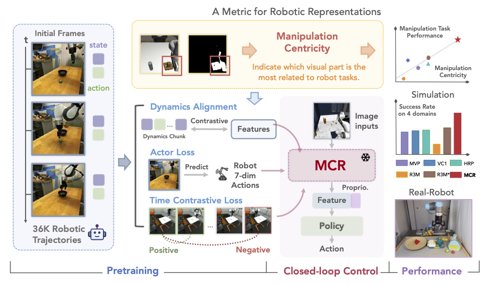

# [🧸 Robots Pre-Train Robots: Manipulation-Centric Robotic Representation from Large-Scale Robot Datasets](https://robots-pretrain-robots.github.io/)

<a href="https://robots-pretrain-robots.github.io/"><strong>Project Page</strong></a>
  |
  <a href="https://arxiv.org/abs/2410.22325"><strong>arXiv</strong></a>
  |
  <a href="https://x.com/LuccaChiang/status/1851651164187635732"><strong>Twitter</strong></a> 
  | <a href="https://huggingface.co/GqJiang/robots-pretrain-robots"><strong>Dataset & Model</strong></a>

  <a href="https://luccachiang.github.io/">Guangqi Jiang*</a>, 
  <a href="https://guangnianyuji.github.io/">Yifei Sun*</a>, 
  <a href="https://taohuang13.github.io/">Tao Huang*</a>, 
  <a href="https://github.com/xierhill">Huanyu Li</a>, 
  <a href="https://cheryyunl.github.io/">Yongyuan Liang</a>, 
  <a href="http://hxu.rocks/">Huazhe Xu</a>


**ICLR, 2025**

<div align="center">
  
</div>

# 🗞️ News

- **2025-01-22** Our paper is accepted by ICLR 2025!
- **2024-12-13** Refine the README and add dataset-related files.
- **2024-10-31** Release code!
- **2024-10-29** Release our paper on ArXiv.


# 🛠️ Installation

Clone this repository and create a conda environment:

    git clone https://github.com/luccachiang/robots-pretrain-robots.git
    cd robots-pretrain-robots
    conda remove -n mcr --all
    conda env create -f mcr/mcr.yaml
    conda activate mcr


Install MCR:

    pip install -e .

# 📚 Data and checkpoints
Our pre-trained model checkpoints are availble on our [Huggingface repository](https://huggingface.co/GqJiang/robots-pretrain-robots). Please follow these steps to prepare the dataset we use in the paper.
```
# install packages
cd robots-pretrain-robots
apt-get install libgmp-dev
pip install -r dataset_requirements.txt

# download raw dataset from the DROID website https://droid-dataset.github.io/
gsutil -m cp -r gs://gresearch/robotics/droid <your_local_path> # we use the full 1.7TB dataset
```
Then please refer to the [data extraction script](scripts/process_data_multicore.py) and [data cleaning script](scripts/delete_short_videos.py) to get the subset, which should also be around 1.7TB. You may search for `TODO` in these files. You will get a dataset with the following structure. As long as your dataset share the same structure, you can directly train MCR on your custom dataset with slight modifications on the dataloader. Otherwise you need to write your own dataloader.
```
/droid_processed
    /2023-02-28_Tue_Feb_28_20_25_47_2023
        /exterior_image_1_left
            /0.png
            /1.png
            ...
        /exterior_image_2_left
        other_data.pkl # proprioception and actions
    /2023-02-28_Tue_Feb_28_20_26_11_2023
    ...
```

# 💻 Usage
You can use this codebase for the following purposes:

## 1. Use our released pre-trained checkpoints.

    # first, download our model checkpoint from Huggingface
    # then get a torchvision.models.resnet50
    import mcr
    encoder = mcr.load_model(ckpt_path=<path_to_downloaded_ckpt>)

    # please see more details in utils/example.py

## 2. Train MCR from scratch.

    # first, prepare the dataset with scripts we provide
    # then run
    cd mcr
    bash train_mcr.sh
    # you can get a full list of parameter helps in train_mcr.sh

## 3. Train MCR with custom dataset.
We also provide a guidance on how to train MCR on your own dataset. You can either process your data into the structure we provide above or modify the codebase to write your own dataloader. 
1. Refer to [data_loaders.py](mcr/utils/data_loaders.py) to write your own dataloader. Mainly pay attention to the `_sample` method.
2. Refer to [train_representation.py](mcr/train_representation.py) to construct your workspace. You may need to modify the dataset-related code and the `train` method to properly iterate your dataset.
3. Refer to [train_mcr.sh](mcr/train_mcr.sh) to launch the training and override hyper-paremeters.
4. (Optional) Losses are defined in [trainer.py](mcr/trainer.py). If necessary, debug this file.


# 🧭 Code Navigation
[mcr](mcr) contains our pre-training codebase. We introduce some important files below.

    cfgs/config_rep.yaml                # pre-training configs
    models/models_mcr.py                # MCR model architecture, backbone, actor, and some projectors here
    utils/data_loaders.py               # dataloaders
    train_mcr.sh                        # training script, override configs here
    train_representation.py             # training workspace
    trainer.py                          # losses are defined here

# 🏷️ Licence
This repository is released under the MIT license. See [LICENSE](LICENSE) for additional details.

# ✉️ Acknowledgement & Contact
Our codebase is built upon [R3M](https://github.com/facebookresearch/r3m.git). We thank all these authors for their nicely open sourced code and their great contributions to the community.

Please contact [Guangqi Jiang](https://luccachiang.github.io/) if you are interested in this project. Also feel free to open an issue or raise a pull request :)


# 📝 BibTeX

We will be glad if you find this work helpful. Please consider citing:
```
@article{jiang2024robots,
        title={Robots Pre-Train Robots: Manipulation-Centric Robotic Representation from Large-Scale Robot Datasets},
        author={Jiang, Guangqi and Sun, Yifei and Huang, Tao and Li, Huanyu and Liang, Yongyuan and Xu, Huazhe},
        journal={arXiv preprint arXiv:2410.22325},
        year={2024}
        }
```
